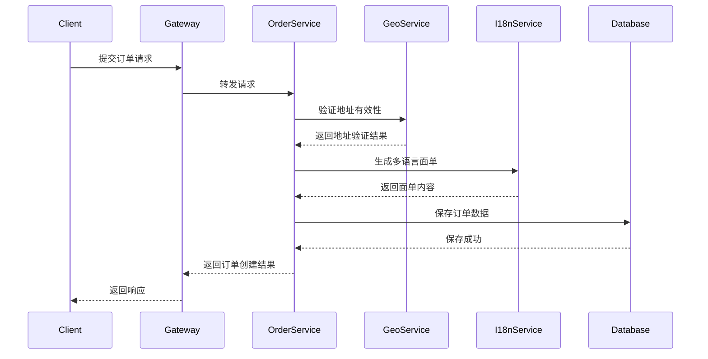
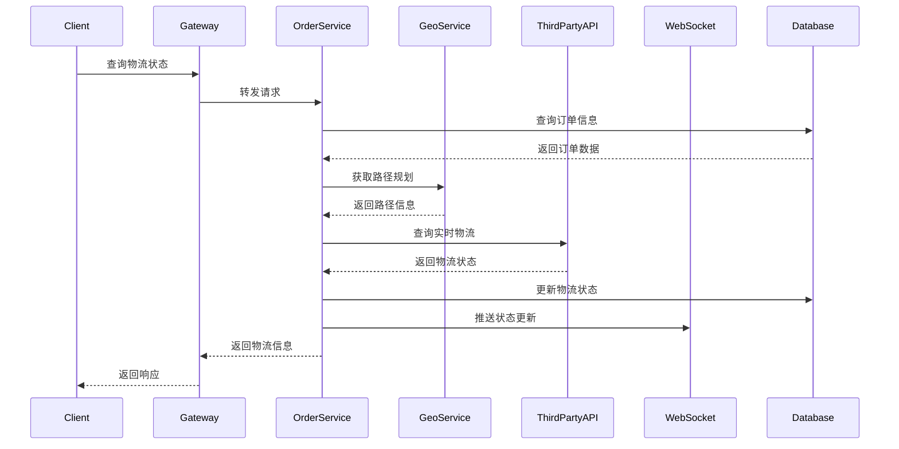
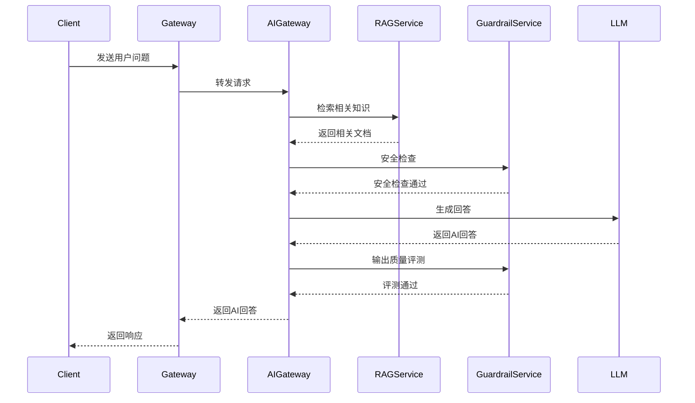

# GGL-Hub 概要设计文档

## 📋 文档概述

本文档是 GGL-Hub 企业级全球化智能物流调度平台的概要设计文档，主要描述系统的功能模块划分、接口设计、数据模型和系统交互流程。

## 🎯 系统目标

### 1. 业务目标
- 构建全球化物流订单管理平台
- 实现智能路径规划和调度
- 提供多语言面单生成服务
- 集成 AI 客服和知识检索
- 确保系统高可用和可扩展

### 2. 技术目标
- 采用微服务架构，实现服务解耦
- 支持容器化部署和弹性伸缩
- 集成 AI 能力，提升智能化水平
- 建立完善的监控和运维体系
- 保障系统安全和数据隐私

## 🏗️ 系统架构概览

### 1. 系统组成
```
┌─────────────────────────────────────────────────────────────┐
│                   前端应用层                                 │
│  • Web 管理后台                                            │
│  • 移动端应用                                              │
│  • API 接口层                                              │
└───────────────────────────┬─────────────────────────────────┘
                            │
┌───────────────────────────▼─────────────────────────────────┐
│                   API 网关层                                │
│  • 统一入口和路由                                          │
│  • 认证鉴权                                              │
│  • 限流熔断                                              │
└───────────────────────────┬─────────────────────────────────┘
                            │
┌───────────────────────────▼─────────────────────────────────┐
│                   业务服务层                                │
│  ┌─────────┐  ┌─────────┐  ┌─────────┐  ┌─────────┐      │
│  │ 订单服务│  │地理服务 │  │国际化服务│  │知识服务 │      │
│  └─────────┘  └─────────┘  └─────────┘  └─────────┘      │
│  ┌─────────┐  ┌─────────┐                                │
│  │安全服务 │  │AI 服务  │                                │
│  └─────────┘  └─────────┘                                │
└───────────────────────────┬─────────────────────────────────┘
                            │
┌───────────────────────────▼─────────────────────────────────┐
│                   基础设施层                                │
│  • 注册中心 (Nacos)                                       │
│  • 数据库 (MySQL/Redis)                                   │
│  • 对象存储 (MinIO)                                       │
│  • 监控系统 (Prometheus/Grafana)                          │
└─────────────────────────────────────────────────────────────┘
```

## 🔧 功能模块设计

### 1. 订单管理模块
#### 功能描述
- 订单创建、查询、修改、删除
- 订单状态流转管理
- 支付和退款处理
- 物流追踪和状态更新
- 订单统计和报表生成

#### 核心接口
- `POST /api/orders` - 创建订单
- `GET /api/orders/{id}` - 查询订单详情
- `PUT /api/orders/{id}/status` - 更新订单状态
- `GET /api/orders` - 查询订单列表
- `POST /api/orders/{id}/pay` - 支付订单
- `POST /api/orders/{id}/refund` - 申请退款

### 2. 地理信息服务模块
#### 功能描述
- 地址解析和地理编码
- 坐标转换 (WGS84/GCJ02/BD09)
- 路径规划和距离计算
- 地理围栏和区域管理
- 实时位置追踪

#### 核心接口
- `POST /api/geo/geocode` - 地址解析
- `POST /api/geo/convert` - 坐标转换
- `POST /api/geo/route` - 路径规划
- `POST /api/geo/distance` - 距离计算
- `GET /api/geo/fence/{id}` - 查询地理围栏

### 3. 国际化服务模块
#### 功能描述
- 多语言翻译服务
- 智能面单模板生成
- 国际化资源管理
- 货币和时区转换
- 本地化内容适配

#### 核心接口
- `POST /api/i18n/translate` - 文本翻译
- `POST /api/i18n/label` - 生成面单
- `GET /api/i18n/resources/{lang}` - 获取资源文件
- `POST /api/i18n/currency` - 货币转换
- `POST /api/i18n/timezone` - 时区转换

### 4. 知识检索服务模块
#### 功能描述
- 文档向量化和存储
- 智能语义检索
- 知识库管理
- 问答系统支持
- 文档相似度计算

#### 核心接口
- `POST /api/rag/documents` - 上传文档
- `POST /api/rag/search` - 语义搜索
- `POST /api/rag/qa` - 智能问答
- `GET /api/rag/documents/{id}` - 查询文档
- `DELETE /api/rag/documents/{id}` - 删除文档

### 5. AI 安全防护模块
#### 功能描述
- 内容安全审核
- Prompt 注入检测
- AI 输出质量评测
- 敏感信息过滤
- 合规性检查

#### 核心接口
- `POST /api/guardrail/content` - 内容审核
- `POST /api/guardrail/prompt` - Prompt 安全检查
- `POST /api/guardrail/evaluate` - AI 输出评测
- `POST /api/guardrail/filter` - 敏感信息过滤
- `GET /api/guardrail/rules` - 获取安全规则

### 6. AI 编排网关模块
#### 功能描述
- 多 LLM 调度和负载均衡
- Agent 编排和执行
- 流式响应支持
- 上下文管理
- 对话历史管理

#### 核心接口
- `POST /api/ai/chat` - 智能对话
- `POST /api/ai/stream` - 流式对话
- `POST /api/ai/agent` - Agent 执行
- `GET /api/ai/models` - 获取可用模型
- `POST /api/ai/context` - 管理对话上下文

## 📊 数据模型设计

### 1. 订单核心实体
```sql
-- 订单实体
Order {
    id: Long
    orderNo: String
    userId: Long
    totalAmount: Decimal
    payAmount: Decimal
    status: Enum
    shippingAddress: String
    createTime: DateTime
    updateTime: DateTime
}

-- 订单项实体
OrderItem {
    id: Long
    orderId: Long
    productId: Long
    productName: String
    quantity: Integer
    price: Decimal
    subtotal: Decimal
}

-- 支付记录实体
PaymentRecord {
    id: Long
    orderId: Long
    paymentNo: String
    paymentMethod: String
    paymentAmount: Decimal
    status: Enum
    paymentTime: DateTime
}
```

### 2. 地理信息实体
```sql
-- 地址实体
Address {
    id: Long
    country: String
    province: String
    city: String
    district: String
    street: String
    postalCode: String
    latitude: Double
    longitude: Double
    coordinateSystem: String
}

-- 路径实体
Route {
    id: Long
    startAddressId: Long
    endAddressId: Long
    distance: Double
    duration: Integer
    polyline: String
    createTime: DateTime
}
```

### 3. 国际化实体
```sql
-- 翻译实体
Translation {
    id: Long
    sourceText: String
    sourceLang: String
    targetText: String
    targetLang: String
    domain: String
    createTime: DateTime
}

-- 面单模板实体
LabelTemplate {
    id: Long
    templateName: String
    templateType: String
    content: Text
    variables: JSON
    supportedLanguages: JSON
    createTime: DateTime
}
```

### 4. 知识库实体
```sql
-- 文档实体
Document {
    id: Long
    title: String
    content: Text
    contentType: String
    embedding: Vector
    metadata: JSON
    createTime: DateTime
}

-- 向量索引实体
VectorIndex {
    id: Long
    documentId: Long
    chunkIndex: Integer
    chunkText: String
    embedding: Vector
    metadata: JSON
}
```

## 🔄 系统交互流程

### 1. 订单创建流程


### 2. 物流追踪流程


### 3. AI 客服流程


## 🔐 安全设计

### 1. 认证授权机制
- **JWT Token 认证**：基于 Token 的无状态认证
- **RBAC 权限控制**：基于角色的访问控制
- **API 密钥管理**：第三方接入的 API 密钥管理
- **OAuth2.0 支持**：支持第三方登录集成

### 2. 数据安全
- **HTTPS 加密传输**：所有接口强制 HTTPS
- **敏感数据加密**：密码、支付信息等加密存储
- **数据脱敏处理**：日志和接口返回数据脱敏
- **SQL 注入防护**：参数化查询和 SQL 过滤

### 3. 接口安全
- **接口签名验证**：防止请求篡改
- **防重放攻击**：时间戳 + nonce 机制
- **限流保护**：基于 IP 和用户的限流
- **黑名单机制**：恶意请求 IP 封禁

## 📈 性能设计

### 1. 响应时间目标
- **API 网关**：< 50ms
- **订单服务**：< 100ms
- **地理服务**：< 200ms
- **AI 服务**：< 3000ms（流式响应）

### 2. 并发能力目标
- **单实例 QPS**：> 1000
- **集群 QPS**：> 10000
- **连接数**：> 10000
- **吞吐量**：> 100MB/s

### 3. 缓存策略
- **热点数据缓存**：Redis 缓存热点数据
- **查询结果缓存**：频繁查询结果缓存
- **页面静态化**：静态页面 CDN 加速
- **数据库缓存**：MySQL 查询缓存优化

## 🔧 部署设计

### 1. 环境规划
| 环境 | 用途 | 实例数 | 数据库 | 备注 |
|------|------|--------|--------|------|
| 开发环境 | 开发测试 | 1-2 | 单实例 | 本地 Docker |
| 测试环境 | 功能测试 | 2-3 | 主从 | 集成测试 |
| 预发环境 | 性能测试 | 3-4 | 集群 | 压测验证 |
| 生产环境 | 线上服务 | 4+ | 高可用集群 | 多可用区 |

### 2. 部署策略
- **容器化部署**：所有服务 Docker 容器化
- **滚动更新**：零停机部署更新
- **蓝绿部署**：生产环境无缝切换
- **金丝雀发布**：渐进式流量切换

### 3. 监控告警
- **应用监控**：JVM 监控、接口监控
- **业务监控**：订单量、成功率、响应时间
- **基础设施监控**：CPU、内存、磁盘、网络
- **告警机制**：分级告警、多渠道通知

## 📝 接口规范

### 1. RESTful 规范
- **URL 设计**：`/api/{version}/{resource}/{id}`
- **HTTP 方法**：GET/POST/PUT/DELETE
- **状态码**：标准 HTTP 状态码
- **版本管理**：URL 路径版本控制

### 2. 请求响应格式
```json
// 请求示例
{
  "header": {
    "requestId": "uuid",
    "timestamp": 1640995200000,
    "version": "v1"
  },
  "body": {
    // 业务参数
  }
}

// 响应示例
{
  "code": 200,
  "message": "success",
  "data": {
    // 业务数据
  },
  "timestamp": 1640995200000,
  "traceId": "trace-id"
}
```

### 3. 错误码规范
| 错误码 | 含义 | 说明 |
|--------|------|------|
| 200 | 成功 | 请求成功 |
| 400 | 参数错误 | 请求参数错误 |
| 401 | 未授权 | 认证失败 |
| 403 | 禁止访问 | 权限不足 |
| 404 | 资源不存在 | 请求的资源不存在 |
| 500 | 服务器错误 | 服务器内部错误 |
| 503 | 服务不可用 | 服务暂时不可用 |

## 🔮 扩展性设计

### 1. 水平扩展
- **无状态服务**：支持水平扩展
- **数据库分片**：按业务分库分表
- **缓存集群**：Redis 集群扩展
- **负载均衡**：Nginx + 服务发现

### 2. 垂直扩展
- **资源优化**：JVM 参数调优
- **连接池优化**：数据库连接池配置
- **线程池优化**：合理配置线程池
- **GC 优化**：选择合适的垃圾回收器

### 3. 功能扩展
- **插件化架构**：支持功能插件化
- **API 扩展**：向后兼容的 API 扩展
- **配置化开发**：通过配置实现新功能
- **微服务拆分**：按需拆分微服务

---

**文档版本**: v1.0  
**最后更新**: 2026-03-17  
**维护团队**: GGL-Hub 设计组